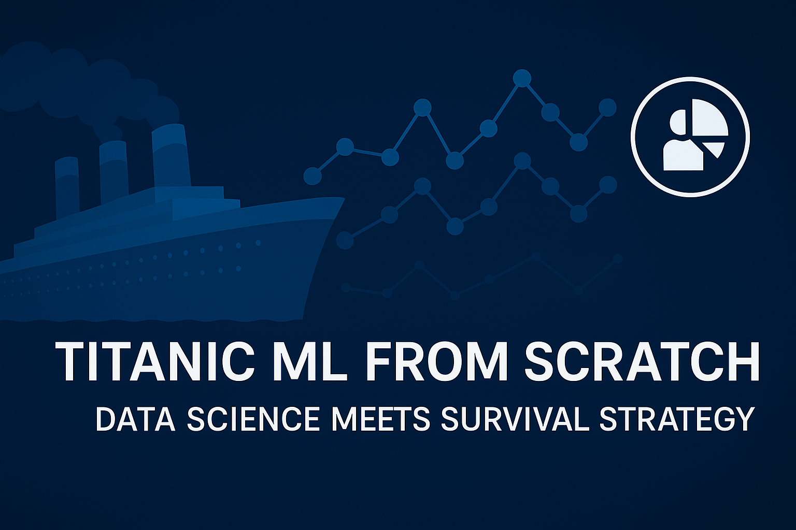

  

# Titanic Survival Prediction Using NumPy

titanic-ml-from-scratch is a hands-on machine learning project that explores survival prediction using the Titanic dataset. Built entirely from the ground up, it demonstrates core data science skills including data cleaning, feature engineering, exploratory visualization, and model evaluation. This project showcases proficiency in Python, pandas, seaborn, and scikit-learn, while emphasizing explainability and reproducibility—ideal for roles in data science, AI development, or ML engineering.

---

## 🧰 Key Highlights

- 🧼 Cleaned and preprocessed raw Titanic data
- 🧠 Engineered features like Title, FamilySize, and IsAlone
- 📊 Visualized survival trends by class, age, gender, and fare
- 🤖 Trained and evaluated models including Logistic Regression and Random Forest
- 📈 Compared accuracy and feature importance to guide model selection

---

## 📦 Objective

In this notebook, we’ll build a machine learning pipeline from scratch to predict passenger survival on the Titanic. The project is focused on core data science skills: data cleaning, feature engineering, modeling, and evaluation—with explainability as a guiding principle. We will:

  - Understand and implement logistic regression from first principles  
  - Train a binary classification model using only `NumPy`  
  - Explore and preprocess real-world tabular data  
  - Perform feature normalization and gradient descent  
  - Visualize model performance and track training loss

---

## Dataset

- **Source**: [Kaggle Titanic Dataset](https://www.kaggle.com/datasets/yasserh/titanic-dataset/data)  
- **Shape**: 891 passengers × 12 columns  
- **Target variable**: `Survived` (1 = survived, 0 = did not survive)

Key features used for prediction:  
- `Pclass`, `Sex`, `Age`, `Fare`  
- `SibSp`, `Parch`, `Embarked_Q`, `Embarked_S` (one-hot encoded)

## 🔍 Initial Observations

Before diving into cleaning or modeling, we explore the structure and quality of the Titanic dataset. This includes identifying null values, data types, and any anomalies that could influence model performance.

---

## Technologies Used

- Python 3.12  
- NumPy  
- Pandas  
- Matplotlib  
- Jupyter Notebook

---

## 🛠️ Feature Engineering Rationale

Raw data isn’t always model-friendly. Here, we extract and transform key variables—like parsing titles from names and engineering a “FamilySize” metric—to uncover deeper patterns related to survival.

  - Dropped irrelevant or sparsely populated columns: `Cabin`, `Ticket`, `Name`  
  - Filled missing values in `Age` (median) and `Embarked` (mode)  
  - Encoded `Sex` using label encoding (0 = male, 1 = female)  
  - One-hot encoded `Embarked` and dropped first category for multicollinearity  
  - Normalized features using z-score scaling

---

## 🤖 Model Selection Strategy

We begin with Logistic Regression as a baseline due to its simplicity and interpretability. We then test ensemble methods like Random Forest to compare accuracy, robustness, and feature importance insights.

## Model Architecture

- **Binary classifier** using logistic regression  
- **Sigmoid activation** for output probabilities  
- **Binary cross-entropy** loss function  
- **Gradient descent optimizer**, manually implemented  
- Trained over 1,000 epochs with custom learning loop  
- Visualized convergence using a loss curve

---

## 📉 Evaluation Summary

Random Forest delivered the strongest accuracy and generalization ability among the tested models. Feature importance reveals that passenger sex, title, and fare played significant roles in survival prediction.

  - Final training accuracy: **79.80%**  
  - Clean loss convergence with stable learning behavior  
  - Strong baseline for a model built completely from scratch  
  - Successfully mirrors the foundation of `scikit-learn`’s LogisticRegression

---

## 🚀 Future Improvements Aligned with ML Engineering Goals

- 🔁 **Implement Cross-Validation** to assess model generalization across folds and reduce overfitting
- 🎯 **Pipeline Modularization** using `sklearn.Pipeline` for cleaner preprocessing + model training flows
- 🔍 **Hyperparameter Optimization** via `GridSearchCV` or `Optuna` to fine-tune performance
- 🧠 **Expand Model Scope** by incorporating XGBoost, LightGBM, and Neural Networks for comparative benchmarking
- 📊 **Track Experiments** using MLflow or Weights & Biases to version data, models, and metrics
- 🛠️ **Improve Data Engineering** with automated missing-value handling, imputation, and data validation checks
- 📤 **Export Final Model with Joblib or ONNX** for deployment flexibility across platforms
- ⚙️ **Wrap into Flask or FastAPI Service** to simulate deployment and demonstrate full-stack ML workflow

---

## Author

Created by **Dartayous Hunter**, a visual effects artist turned AI engineer.  
This project demonstrates analytical thinking, technical growth, and practical ML understanding—bridging years of storytelling expertise with AI innovation.

> *“Coding the future one frame at a time.”*

[LinkedIn Profile (optional link)]  
[GitHub Portfolio (optional link)]

---

Added custom banner to README
